<h1>ContentProvider list demo app</h1>
<h2>Android (Kotlin)</h2>
<b>Main tools</b>
<ul>
<li>Content provider</li>
<li>Lottie (animations)</li>
<li>Shared transitions</li>
</ul>

<h1>Description</h1>

This app is meant to be a type of items list, like a shopping list or a wishlist

The core of this app was to use a content provider to take the data from another App, which has the database, and display and edit it on the current app

The app with the database is not included inside this repository, but the implementation is similar to the one that an app needs to use the smartphone contacts through a content provider

As is a really simple app, I've decided to add animations and fluid transitions to it. The Icons animations were achieved by creating animations with Adobe AE and exporting it to Android Studio with the Lottie SDK

Academic demo app, this app is not completely debugged, it's just a demo. It could contain not extracted text strings and not properly indented code

 * The content provider from the external app has been added to this repo in order to facilitate the testing of the current app 

<h1>Screenshots</h1>

  <a href='#img1'>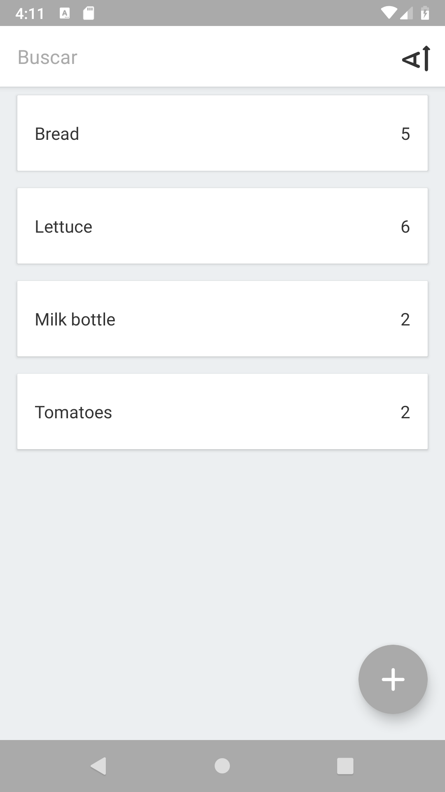</a>
  <a href='#img2'>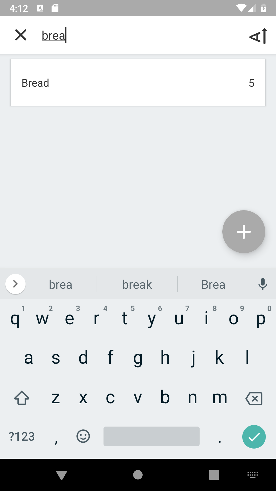</a>
  <a href='#img3'>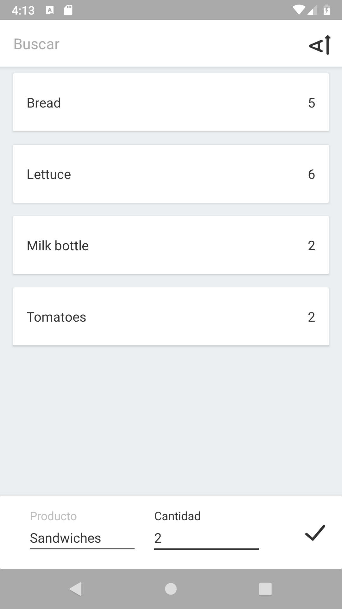</a>

  <a href='#img4'>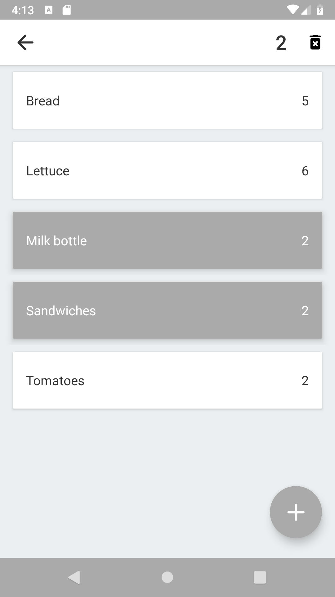</a>
  <a href='#img5'>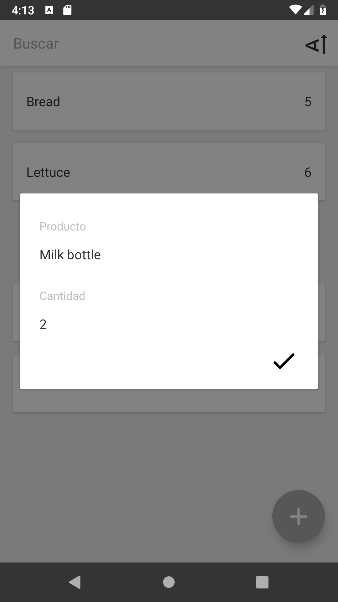</a>

<h1>Demo *</h1>

*A higher quality and longer video opens on YouTube when clicked

  <a href='https://www.youtube.com/watch?v=Ttep1O52Tnc'>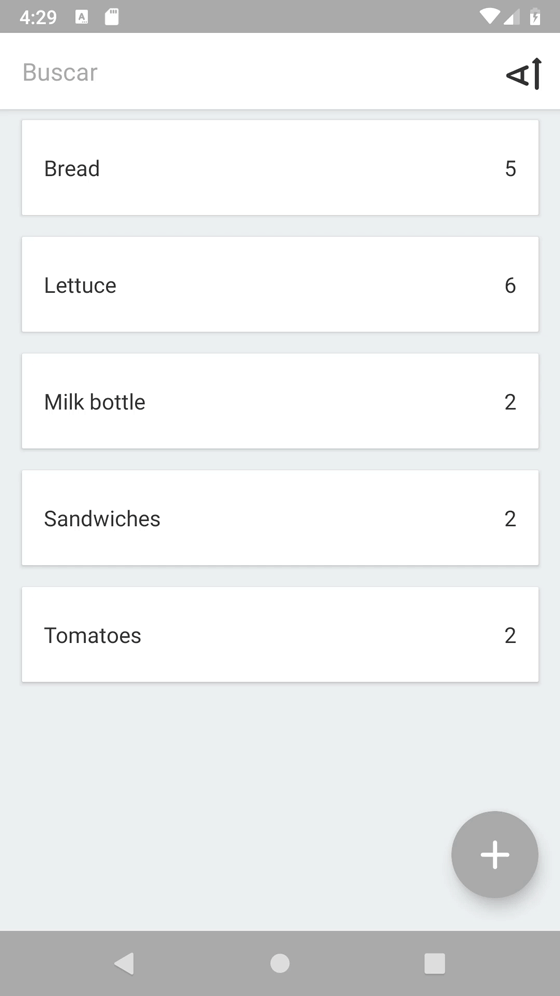</a>
  <a href='#imgE1'>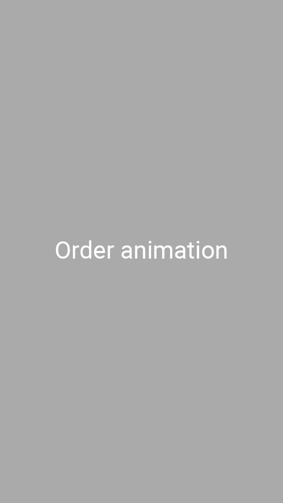</a>

 

  <a href='#imgE2'>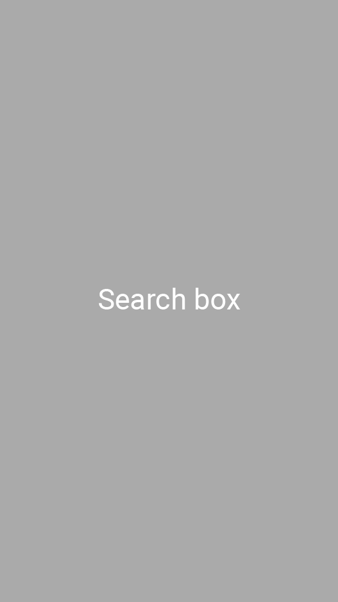</a>
  <a href='https://www.youtube.com/watch?v=o-x9R2TmzwE'>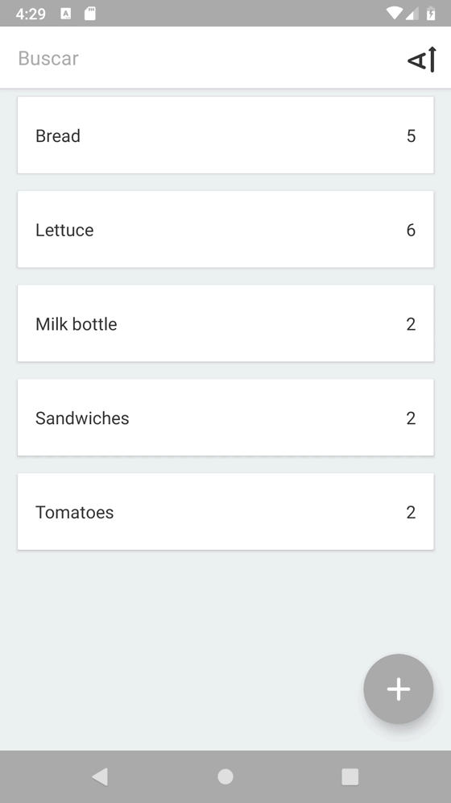</a>

 

  <a href='https://www.youtube.com/watch?v=PYl7H_IjebA'>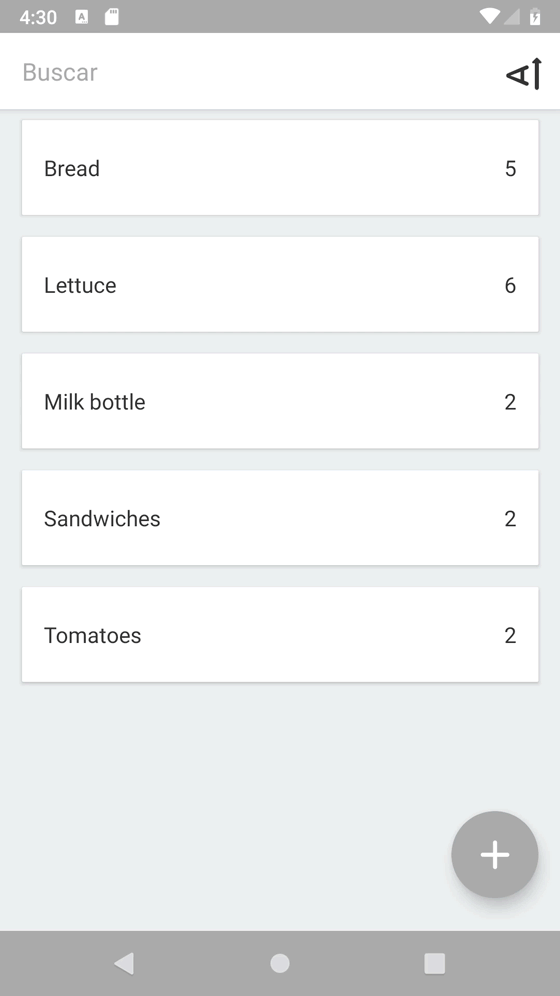</a>
   <a href='#imgE3'>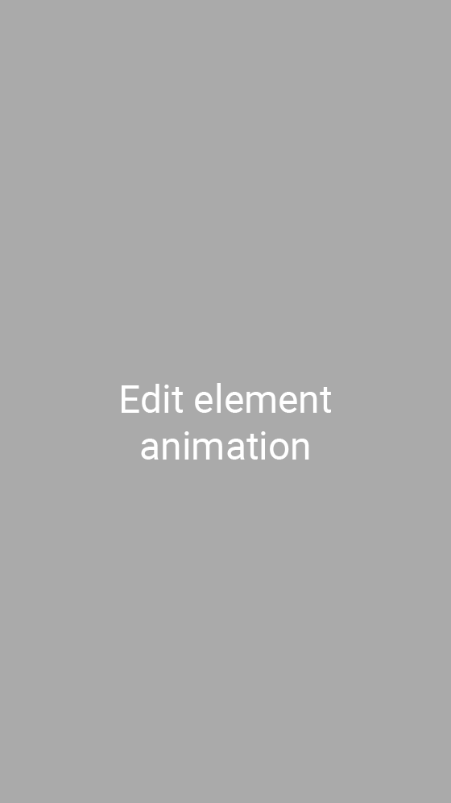</a>

  <a href='#imgE4'>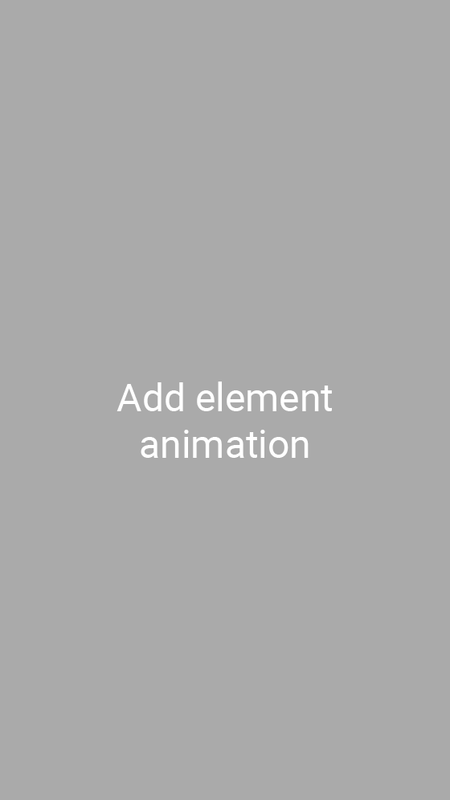</a>
  <a href='https://www.youtube.com/watch?v=DUu83fa6e2o'>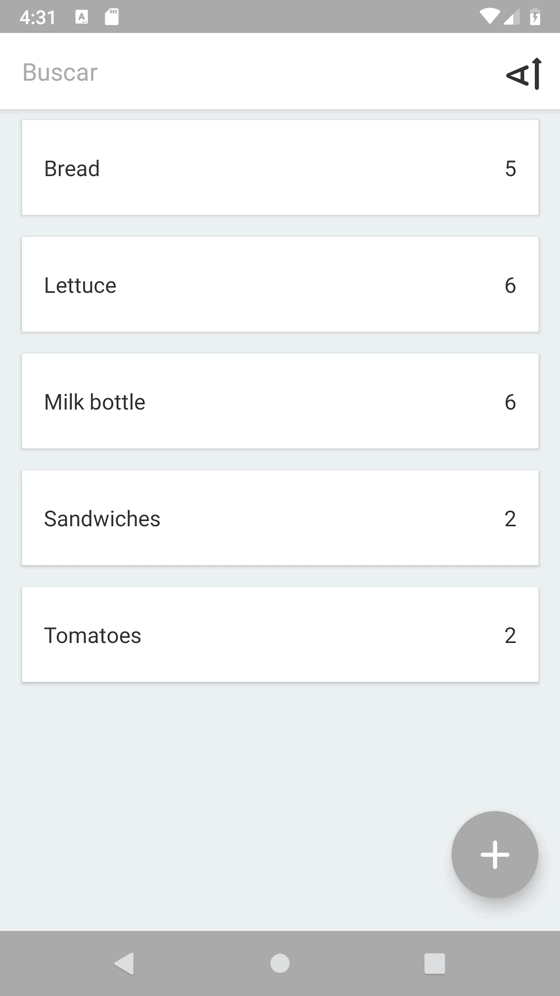</a>

  <a href='https://www.youtube.com/watch?v=6kUGNW0mbhg'>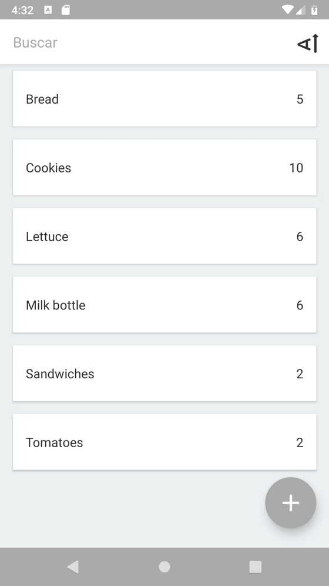</a>
   <a href='#imgE5'>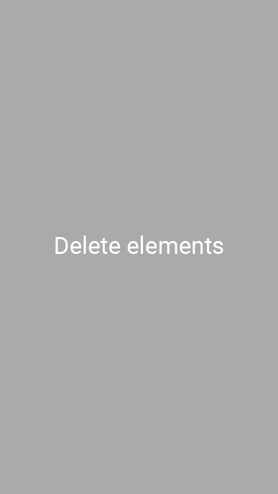</a>

<h1>License</h1>

This repo acts like a portfolio and the app contained here <b>can't hold liability neither place warranty</b>. Furthermore, the final porpouse of this app is not decided yet, so in order to avoid problems in the future this repo has a <b>NonCommercial</b> CC-BY-NC license

 This work is licensed under a <a rel="license" href="http://creativecommons.org/licenses/by-nc-nd/4.0/">Creative Commons Attribution-NonCommercial-NoDerivatives 4.0 International License</a>.
